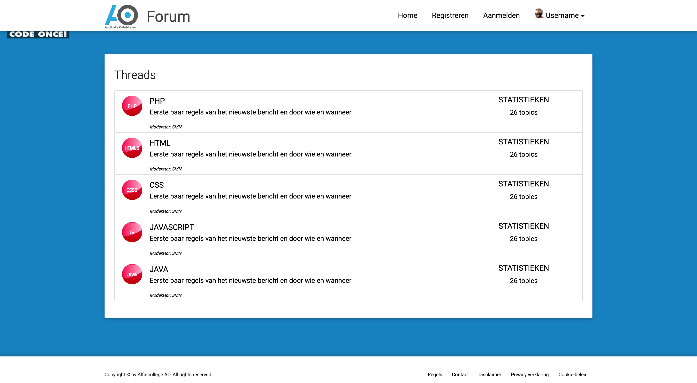
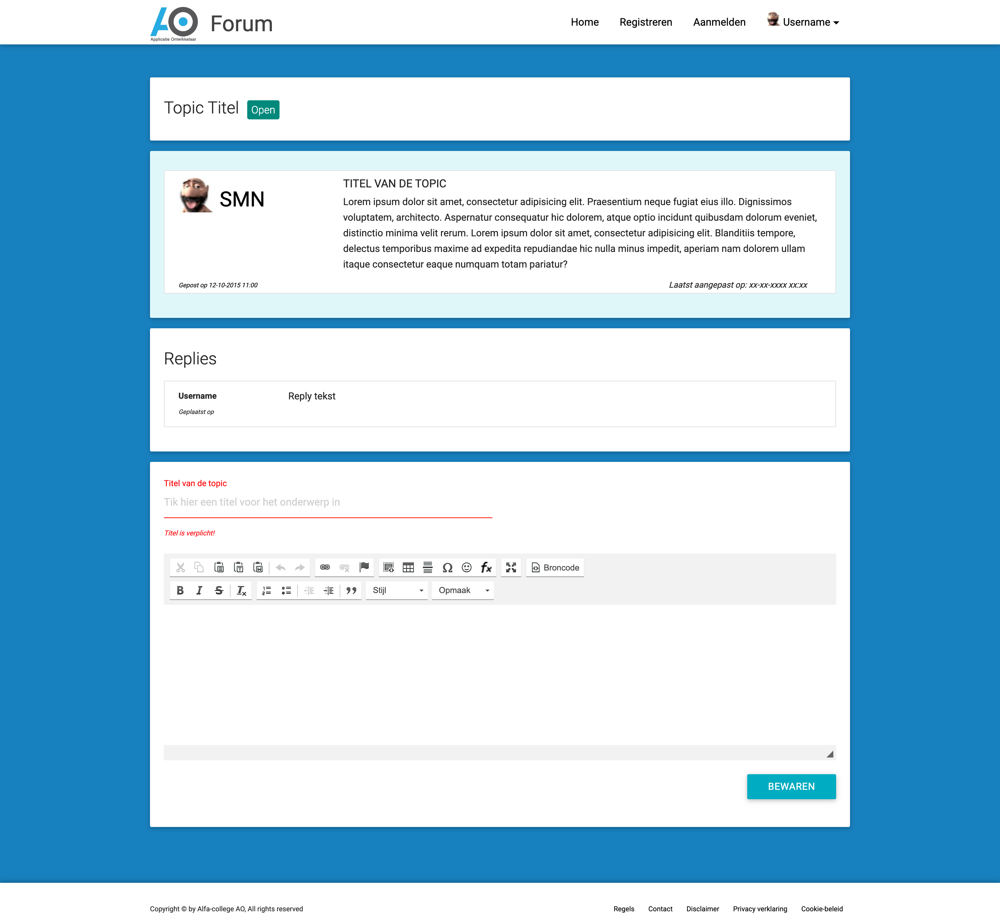

# Module Forum 2.0
Introductie en basiskennis & -vaardigheden in Laravel  
  
## Vooraf
In veel projecten behoort het bouwen van de UI tot voorwerk. Dus werk wat we doen voordat we de applicatie daadwerkelijk gaan programmeren.  
Ten behoeve van de instructiemomenten behorende bij deze module gaan we er vanuit dat het voorwerk al gedaan is en dus de UI qua code klaar staat.  

## Wat vind je hier?
In deze repo zie allereerst een map genaamd **design**. In deze map vinden we alle code van het voorwerk (bouwen van de UI) terug. De code betreft alle HTML, CSS en (eventueel) JavaScript.  

## Wat doen we met de code?
De code in de map **design** gebruiken we in de views van ons Laravel project. Dit doen we door:  
* De assets (stylesheet, images, fonts, javascript e.d.) te kopiëren naar de public map in ons Laravel project  
* Steeds voor iedere view in de bestanden hier te duiken en de stukken HTML te kopiëren naar de view.

## UI 
### Startpagina
  
  
### Threadpagina
Toont alle topics in de betreffende thread  
  
  
### Topicpagina
Toont alle replies van een topic  
  
